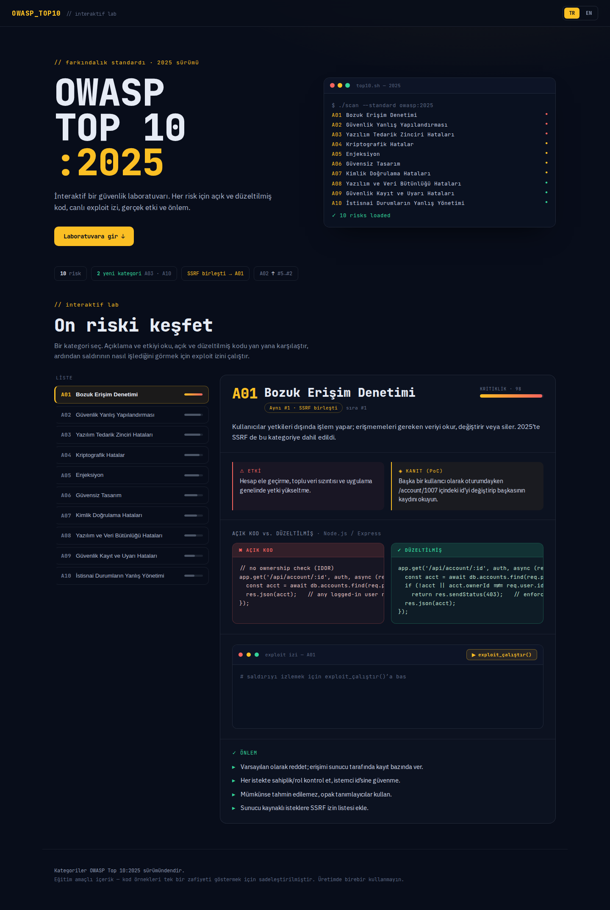

# OWASP Top 10 Lab
### OWASP Top 10:2025 — Vulnerable & Fixed Implementations with Interactive Lab

[](https://github.com/frknian/OWASP_TOP_10/actions)

A learning and portfolio project that demonstrates web application security vulnerabilities through deliberately vulnerable mini web applications. Each vulnerability includes a **Vulnerable / Fixed** version pair, CVSS/CWE/ASVS mapping, and a professional-grade penetration testing report.

Bilinçli olarak zafiyetli mini web uygulamaları üzerinde web güvenliği zafiyetlerini gösteren, her zafiyet için **Vulnerable / Fixed** sürüm çifti, CVSS/CWE/ASVS eşlemesi ve profesyonel formatta pentest raporu üreten bir öğrenme ve portföy projesi.

---

## Languages / Diller
* [English Version](#english-version)
* [Türkçe Sürüm](#türkçe-sürüm)

---

## English Version

> 📖 **New to the project? We recommend reading [INTRODUCTION.md](INTRODUCTION.md) first (in Turkish)** — It covers what the OWASP Top 10 is, the 10 categories in the 2025 list, fundamental security defense principles, and our learning methodology.

### Preview



> ⚠️ **Ethical Use:** All modules run exclusively on the local lab environment (`127.0.0.1`). No requests are sent to external/third-party systems. The sole purpose of this project is to document defensive and offensive security skills for educational and portfolio purposes.

---

### Scope
**A completed portfolio project with a clear finish line, covering every category of the OWASP Top 10:2025 with code + test + report + interactive demo.** The scope is strictly limited to these 10 modules; it is not an open-ended platform.

Each vulnerability category is addressed with executable vulnerable code, its corresponding fixed implementation, and a finding report based on industry standards (CVSS 3.1, CWE, OWASP ASVS) — proving and documenting both *how* a vulnerability is exploited and *why* it is fixed.

---

### Module List (OWASP Top 10:2025)
The project has migrated to the **OWASP Top 10:2025** standard. The current module status:

| # | Module | Note | Status |
|---|--------|------|--------|
| A01 | Broken Access Control | Includes SSRF; BOLA/BFLA are explicitly covered | ✅ Completed |
| A02 | Security Misconfiguration | Unused debug endpoints, directory listing, etc. | ✅ Completed |
| A03 | Software Supply Chain Failures | Expansion of "Vulnerable and Outdated Components"; DEFANGED simulation | ✅ Completed (4/4 scenarios) |
| A04 | Cryptographic Failures | Weak hashing, hardcoded keys, plain text storage | ✅ Completed (3/3 scenarios) |
| A05 | Injection | SQLi, ORM Injection, OS Command Injection (DEFANGED), XSS | ✅ Completed (4/4 scenarios) |
| A06 | Insecure Design | Flaw in design, not implementation; requires workflow redesign | ✅ Completed (3/3 scenarios) |
| A07 | Authentication Failures | Brute-force protection, MFA absence, session timeouts | ✅ Completed (3/3 scenarios) |
| A08 | Software or Data Integrity Failures | Insecure deserialization, mass assignment, SRI checks | ✅ Completed (3/3 scenarios) |
| A09 | Security Logging and Alerting Failures | Leaking sensitive data, log forging, alerting thresholds | ✅ Completed (3/3 scenarios) |
| A10 | Mishandling of Exceptional Conditions | New category; replaces SSRF (consolidated to A01) | ✅ Completed (4/4 scenarios) |

> 🏁 **10/10 modules completed — this project is closed and finished.**

---

### Current State & Scenario Details
**10/10 modules are fully implemented — the backend of the OWASP Top 10:2025 Lab is COMPLETE.** A total of **10 modules, 34 scenarios** are available — each with executable Vulnerable/Fixed pairs, CVSS 3.1 score, CWE mapping, OWASP ASVS item, and a pentest report verified with curl or browser tests (code + test + report).

#### Module 01 — Broken Access Control

| Scenario | Vulnerability / CWE | Directory | Status |
|:---:|---|---|:---:|
| 1 | IDOR / Horizontal Privilege Escalation | `01-idor-horizontal-privilege-escalation` | ✅ Completed |
| 2 | Missing Function Level Access Control | `02-missing-function-level-access-control` | ✅ Completed |
| 3 | Client-Side Enforcement Bypass (CWE-602) | `03-client-side-enforcement-bypass` | ✅ Completed |

#### Module 02 — Security Misconfiguration

| Scenario | Vulnerability / CWE | Directory | Status |
|:---:|---|---|:---:|
| 1 | Forgotten Sample App / Default Credentials (CWE-1392/489) | `01-forgotten-sample-app-default-credentials` | ✅ Completed |
| 2 | Directory Listing → Source Exposure (CWE-548/540/798) | `02-directory-listing-source-exposure` | ✅ Completed |
| 3 | Verbose Error Messages (CWE-209) | `03-verbose-error-messages` | ✅ Completed |
| 4 | Public Cloud Storage Misconfiguration (CWE-732/284/1188) | `04-public-cloud-storage-misconfiguration` | ✅ Completed |

#### Module 03 — Software Supply Chain Failures *(DEFANGED simulation; no real malware/RCE/exfiltration)*

| Scenario | Vulnerability / CWE | Ports (Vuln/Fixed) | Directory | Status |
|:---:|---|:---:|---|:---:|
| 1 | Vulnerable Component / Log4Shell-like (CWE-1395/477) | 8050 / 8051 | `01-vulnerable-component-log4shell-style` | ✅ Completed |
| 2 | Conditional Backdoor / Bybit-like (CWE-1395/506) | 8060 / 8061 | `02-conditional-backdoor-bybit-style` | ✅ Completed |
| 3 | Post-install Worm / Shai-Hulud-like (CWE-1395/506) | 8070 / 8071 | `03-postinstall-worm-shai-hulud-style` | ✅ Completed |
| 4 | Component RCE / Struts-like (CWE-1395/477) | 8080 / 8081 | `04-component-rce-struts-style` | ✅ Completed |

#### Module 04 — Cryptographic Failures *(S2/S3 fixed versions are fail-secure; require `ENCRYPTION_KEY` env to start)*

| Scenario | Vulnerability / CWE | Ports (Vuln/Fixed) | Directory | Status |
|:---:|---|:---:|---|:---:|
| 1 | Weak/Unsalted Hashing + Rainbow Table (CWE-327/759/916) | 8090 / 8091 | `01-weak-hashing-rainbow-table` | ✅ Completed |
| 2 | Hardcoded Encryption Key (CWE-321/798) | 8100 / 8101 | `02-hardcoded-encryption-key` | ✅ Completed |
| 3 | Plaintext Sensitive Data at Rest (CWE-311/312) | 8110 / 8111 | `03-plaintext-data-at-rest` | ✅ Completed |

#### Module 05 — Injection *(Scenario 3 is DEFANGED — no real OS command is executed)*

| Scenario | Vulnerability / CWE | Ports (Vuln/Fixed) | Directory | Status |
|:---:|---|:---:|---|:---:|
| 1 | SQL Injection / String Concatenation (CWE-89) | 8120 / 8121 | `01-sql-injection-string-concatenation` | ✅ Completed |
| 2 | ORM Injection / Blind Trust in Frameworks (CWE-89) | 8130 / 8131 | `02-orm-injection-blind-trust` | ✅ Completed |
| 3 | OS Command Injection (CWE-78, DEFANGED) | 8140 / 8141 | `03-os-command-injection-defanged` | ✅ Completed |
| 4 | Reflected XSS (CWE-79) | 8150 / 8151 | `04-reflected-xss` | ✅ Completed |

#### Module 06 — Insecure Design *(Vulnerable vs. Fixed differs by workflow logic/business rules, not just a code patch)*

| Scenario | Vulnerability / CWE | Ports (Vuln/Fixed) | Directory | Status |
|:---:|---|:---:|---|:---:|
| 1 | Insecure Credential Recovery / Security Questions (CWE-640) | 8160 / 8161 | `01-insecure-credential-recovery-questions` | ✅ Completed |
| 2 | Business Logic Bypass / Group Booking (CWE-841/770) | 8170 / 8171 | `02-business-logic-bypass-booking` | ✅ Completed |
| 3 | Missing Rate Limiting / Bot Protection (CWE-770/799) | 8180 / 8181 | `03-missing-rate-limiting-bot-protection` | ✅ Completed |

#### Module 07 — Authentication Failures *(Uses argon2id; flaw lies in brute-force protection, MFA, and session lifecycle)*

| Scenario | Vulnerability / CWE | Ports (Vuln/Fixed) | Directory | Status |
|:---:|---|:---:|---|:---:|
| 1 | Credential Stuffing / No Brute-Force Protection (CWE-307) | 8190 / 8191 | `01-credential-stuffing-no-protection` | ✅ Completed |
| 2 | Password as Single Factor / Lack of MFA (CWE-308) | 8200 / 8201 | `02-password-only-no-mfa` | ✅ Completed |
| 3 | Session Timeout / Broken Logout (CWE-613/287) | 8210 / 8211 | `03-session-timeout-logout-failure` | ✅ Completed |

#### Module 08 — Software or Data Integrity Failures *(S1 is DEFANGED. S3 is NOT defanged — real W3C SRI behavior is shown)*

| Scenario | Vulnerability / CWE | Ports (Vuln/Fixed) | Directory | Status |
|:---:|---|:---:|---|:---:|
| 1 | Insecure Deserialization (CWE-502, DEFANGED) | 8220 / 8221 | `01-insecure-deserialization-defanged` | ✅ Completed |
| 2 | Mass Assignment (CWE-915) | 8230 / 8231 | `02-mass-assignment` | ✅ Completed |
| 3 | Missing Subresource Integrity / SRI (CWE-829) | 8240 / 8241 | `03-missing-subresource-integrity` | ✅ Completed |

#### Module 09 — Security Logging and Alerting Failures *(Logging works in both versions of S3; difference is in alerting)*

| Scenario | Vulnerability / CWE | Ports (Vuln/Fixed) | Directory | Status |
|:---:|---|:---:|---|:---:|
| 1 | Sensitive Data Exposure in Logs (CWE-532) | 8250 / 8251 | `01-sensitive-data-in-logs` | ✅ Completed |
| 2 | Log Injection / Forging (CWE-117) | 8260 / 8261 | `02-log-injection-forging` | ✅ Completed |
| 3 | Lack of Alerting / No Threshold (CWE-778) | 8270 / 8271 | `03-missing-alerting-threshold` | ✅ Completed |

#### Module 10 — Mishandling of Exceptional Conditions *(New OWASP Top 10:2025 category)*

| Scenario | Vulnerability / CWE | Ports (Vuln/Fixed) | Directory | Status |
|:---:|---|:---:|---|:---:|
| 1 | Resource Exhaustion / DoS (CWE-404/772) | 8280 / 8281 | `01-resource-exhaustion-dos` | ✅ Completed |
| 2 | Fail-Open Authentication (CWE-636) | 8290 / 8291 | `02-fail-open-authentication` | ✅ Completed |
| 3 | Database Error Information Leak (CWE-209) | 8300 / 8301 | `03-database-error-info-leak` | ✅ Completed |
| 4 | Transaction Integrity — Lack of Rollback (CWE-460) | 8310 / 8311 | `04-transaction-integrity-no-rollback` | ✅ Completed |

---

### Tech Stack
- **Backend:** FastAPI (Python)
- **Frontend:** Minimal (Jinja2 / lightweight SPA) — focused on exposing vulnerabilities (XSS, client-side bypass) within API-frontend interactions rather than being a frontend showcase.
- **Environment:** Docker is not used. Each module runs in its own isolated Python `venv` with a dedicated `requirements.txt`. Vulnerable and Fixed versions run on different ports simultaneously.

---

### Project Structure
```
modules/
  01-broken-access-control/
    01-idor-horizontal-privilege-escalation/
      vulnerable/   # Deliberately vulnerable implementation (own venv + requirements.txt)
      fixed/        # Correctly secured implementation (own venv + requirements.txt)
      report.md     # Penetration testing report (CVSS / ASVS / Repro / Remediation)
    02-missing-function-level-access-control/
    ...
control-panel/         # Separate web UI launcher to manage scenarios
```

---

### Control Panel (Launcher)
`control-panel/` is a FastAPI-based dashboard to **start, stop, and interact** with scenarios under `modules/` from a single browser page. It scans the modules, reads the `# PORT: XXXX` comment at the top of each scenario's `main.py`, and spawns each scenario as a separate subprocess within its own virtual environment.

#### Running the Control Panel:
> [!WARNING]
> This application spawns intentionally vulnerable services, hence it must never be run on `0.0.0.0` or be exposed to the internet. Always run it bound to `127.0.0.1`.

```bash
cd control-panel
python3 -m venv venv
./venv/bin/pip install -r requirements.txt
./venv/bin/uvicorn main:app --host 127.0.0.1 --port 9000
# Access in browser: http://127.0.0.1:9000
```
> **Note:** If you are using Python 3.14, Jinja2 3.1.5+ is required (older Jinja2 versions are incompatible with Python 3.14 — `requirements.txt` pins this minimum version).

> 🏠 **Homepage:** `http://127.0.0.1:9000/` redirects to `/app/` featuring a modern landing page with an OWASP Top 10:2025 introduction and module explorer. The technical launcher remains accessible at `/launcher`.

#### Features:
- **Scan & List:** Automatically scans `modules/` and lists Vulnerable/Fixed instances for all 34 scenarios (68 ports in total).
- **Subprocess Management:** Start or stop individual instances directly with a click. Status indicators check port availability in real time.
- **Stop All:** One-click cleanup to terminate all running child processes, finding orphans using `lsof` if necessary.
- **Fail-Secure Integration:** Injects a valid `ENCRYPTION_KEY` env variable automatically when spawning Mod 04 fixed scenarios.
- **Interactive Lab Demos:** Includes **34 bespoke interactive demo components** in a sidebar. Triggers attacks with one click, compares Vulnerable and Fixed HTTP responses side-by-side, and offers step-by-step explanations alongside real `main.py` code highlights under "🔍 How it Works?".

---

### Report Format
Each scenario contains a professional-grade pentest report (`report.md`) detailing:
- Vulnerability Title & CWE Mapping
- CVSS 3.1 Base Score & Vector String
- Risk Level (Low / Medium / High / Critical)
- Relevant OWASP ASVS (Application Security Verification Standard) Controls
- Step-by-Step Reproduction Steps using `curl`
- Business Impact & Threat Modeling
- Remediation Recommendations & Code Verification

---

### Security Notice
> [!CAUTION]
> * This application contains **deliberately vulnerable code** for educational and demonstration purposes.
> * **Local Use Only:** It must strictly run on localhost (`127.0.0.1`). Never configure it to bind to `0.0.0.0` or expose the control panel or spawned services to public networks.

---

### Quality Assurance & Testing
To ensure the correctness of the vulnerabilities and their mitigations:
* We have an automated integration testing suite written in `pytest`.
* **Testing Model:** The tests start the vulnerable or fixed backend, simulate the exploit payload, and assert that the vulnerability succeeds in the vulnerable version and gets blocked (e.g. returning `403` or `503` or sanitized output) in the fixed version.
* **Test Command:**
  ```bash
  # Setup the development environment
  python3 -m venv .venv
  source .venv/bin/activate
  pip install -r requirements-dev.txt
  
  # Run all non-slow/non-browser tests
  PYTHONPATH=. pytest -m "not slow and not browser"
  
  # Check code quality and style
  ruff check .
  ```
* **CI/CD:** A GitHub Actions workflow automates ruff syntax checks, blocking bandit/pip-audit security scans on `control-panel` and `fixed/` implementations, non-blocking informational scans on `vulnerable/` versions, and runs the pytest test suite.

---

### Burp Suite Evidence
* For manual verification, each scenario folder contains an `evidence/` directory with a guide on how to capture, mask, and name screenshots using Burp Suite Proxy or Repeater.
* See the central [BURP_EVIDENCE_GUIDE.md](docs/BURP_EVIDENCE_GUIDE.md) for step-by-step setup and masking instructions.

---

### Demo Video & GIF
* Learn how to record and present the lab using our [DEMO_RECORDING_GUIDE.md](docs/DEMO_RECORDING_GUIDE.md) and [DEMO_SCRIPT.md](docs/DEMO_SCRIPT.md).
* *Preview GIF Placeholder (to be updated when preview.gif is recorded)*
<!--  -->

---

## Türkçe Sürüm

> 📖 **Projeye yeni başlıyorsan önce [INTRODUCTION.md](INTRODUCTION.md)'yi okumanı öneririz** — OWASP Top 10'un ne olduğu, 2025 listesindeki 10 kategori, temel korunma prensipleri ve bu projede nasıl öğrendiğimiz orada anlatılıyor.

### Önizleme


> ⚠️ **Etik kullanım:** Tüm modüller yalnızca yerel lab ortamında (`127.0.0.1`) çalışır. Hiçbir gerçek/üçüncü taraf sisteme istek atılmaz. Amaç savunma ve saldırı yetkinliğini eğitim/portföy bağlamında belgelemektir.

---

### Kapsam
**OWASP Top 10:2025'in her maddesini kod + test + rapor + interaktif demo ile kapsayan, net bir bitiş çizgisi olan tamamlanmış bir portföy projesi.** Kapsam 10 modülle sınırlıdır; açık uçlu bir platform değildir.

Her zafiyet kategorisi; çalıştırılabilir zafiyetli kod, düzeltilmiş karşılığı ve standartlara (CVSS 3.1, CWE, OWASP ASVS) dayalı bir bulgu raporuyla birlikte ele alınır — böylece hem zafiyetin *nasıl* sömürüldüğü hem de *neden* düzeltildiği kanıtlanabilir şekilde belgelenir.

---

### Modül Listesi (OWASP Top 10:2025)
Proje **OWASP Top 10:2021 → 2025** sırasına geçmiştir. Güncel modül durumu:

| # | Modül | Not | Durum |
|---|-------|-----|-------|
| A01 | Broken Access Control | SSRF dahil; BOLA/BFLA açıkça kapsanıyor | ✅ Tamamlandı |
| A02 | Security Misconfiguration | Kullanılmayan debug endpoint'leri, dizin listeleme vb. | ✅ Tamamlandı |
| A03 | Software Supply Chain Failures | Eski "Vulnerable and Outdated Components"ın genişletilmiş hali; senaryolar DEFANGED simülasyon | ✅ Tamamlandı (4/4 senaryo) |
| A04 | Cryptographic Failures | Zayıf hashing, kaynak koda gömülü anahtarlar, açık depolama | ✅ Tamamlandı (3/3 senaryo) |
| A05 | Injection | SQLi, ORM Injection, OS Command Injection (DEFANGED), XSS | ✅ Tamamlandı (4/4 senaryo) |
| A06 | Insecure Design | Tasarım kusuru — düzeltme, iş kuralının yeniden tasarlanması | ✅ Tamamlandı (3/3 senaryo) |
| A07 | Authentication Failures | Brute-force koruması eksikliği, MFA yokluğu, session timeout | ✅ Tamamlandı (3/3 senaryo) |
| A08 | Software or Data Integrity Failures | Güvensiz deserialization, mass assignment, SRI eksikliği | ✅ Tamamlandı (3/3 senaryo) |
| A09 | Security Logging and Alerting Failures | Hassas veri sızması, log injection, alerting eksikliği | ✅ Tamamlandı (3/3 senaryo) |
| A10 | Mishandling of Exceptional Conditions | 2025 yeni kategori; SSRF A01 altına konsolide edildi | ✅ Tamamlandı (4/4 senaryo) |

> 🏁 **10/10 modül tamamlandı — bu proje kapanmıştır.**

---

### Şu Anki Durum & Senaryo Detayları
**10/10 modül tamamlandı — OWASP Top 10:2025 Lab backend'i TAMAMLANMIŞTIR.** Toplam **10 modül, 34 senaryo** — her biri çalıştırılabilir Vulnerable/Fixed sürüm çifti, CVSS 3.1 skoru, CWE eşlemesi, OWASP ASVS kontrol maddesi ve curl (bazı senaryolarda tarayıcı) ile doğrulanmış tam bir pentest raporuyla birlikte (kod + test + rapor).

#### Modül 01 — Broken Access Control

| Senaryo | Zafiyet / CWE | Klasör | Durum |
|:---:|---|---|:---:|
| 1 | IDOR / Horizontal Privilege Escalation | `01-idor-horizontal-privilege-escalation` | ✅ Tamamlandı |
| 2 | Missing Function Level Access Control | `02-missing-function-level-access-control` | ✅ Tamamlandı |
| 3 | Client-Side Enforcement Bypass (CWE-602) | `03-client-side-enforcement-bypass` | ✅ Tamamlandı |

#### Modül 02 — Security Misconfiguration

| Senaryo | Zafiyet / CWE | Klasör | Durum |
|:---:|---|---|:---:|
| 1 | Forgotten Sample App / Default Credentials (CWE-1392/489) | `01-forgotten-sample-app-default-credentials` | ✅ Tamamlandı |
| 2 | Directory Listing → Source Exposure (CWE-548/540/798) | `02-directory-listing-source-exposure` | ✅ Tamamlandı |
| 3 | Verbose Error Messages (CWE-209) | `03-verbose-error-messages` | ✅ Tamamlandı |
| 4 | Public Cloud Storage Misconfiguration (CWE-732/284/1188) | `04-public-cloud-storage-misconfiguration` | ✅ Tamamlandı |

#### Modül 03 — Software Supply Chain Failures *(DEFANGED simülasyon; gerçek zararlı kod/RCE/exfiltration yoktur)*

| Senaryo | Zafiyet / CWE | Port (Vuln/Fixed) | Klasör | Durum |
|:---:|---|:---:|---|:---:|
| 1 | Vulnerable Component / Log4Shell tarzı (CWE-1395/477) | 8050 / 8051 | `01-vulnerable-component-log4shell-style` | ✅ Tamamlandı |
| 2 | Conditional Backdoor / Bybit tarzı (CWE-1395/506) | 8060 / 8061 | `02-conditional-backdoor-bybit-style` | ✅ Tamamlandı |
| 3 | Post-install Worm / Shai-Hulud tarzı (CWE-1395/506) | 8070 / 8071 | `03-postinstall-worm-shai-hulud-style` | ✅ Tamamlandı |
| 4 | Component RCE / Struts tarzı (CWE-1395/477) | 8080 / 8081 | `04-component-rce-struts-style` | ✅ Tamamlandı |

#### Modül 04 — Cryptographic Failures *(S2/S3 fixed sürümleri fail-secure — `ENCRYPTION_KEY` env yoksa başlamayı reddeder)*

| Senaryo | Zafiyet / CWE | Port (Vuln/Fixed) | Klasör | Durum |
|:---:|---|:---:|---|:---:|
| 1 | Weak/Unsalted Hashing + Rainbow Table (CWE-327/759/916) | 8090 / 8091 | `01-weak-hashing-rainbow-table` | ✅ Tamamlandı |
| 2 | Hardcoded Encryption Key (CWE-321/798) | 8100 / 8101 | `02-hardcoded-encryption-key` | ✅ Tamamlandı |
| 3 | Plaintext Sensitive Data at Rest (CWE-311/312) | 8110 / 8111 | `03-plaintext-data-at-rest` | ✅ Tamamlandı |

#### Modül 05 — Injection *(Senaryo 3 command injection DEFANGED — gerçek komut çalıştırılmaz)*

| Senaryo | Zafiyet / CWE | Port (Vuln/Fixed) | Klasör | Durum |
|:---:|---|:---:|---|:---:|
| 1 | SQL Injection / String Concatenation (CWE-89) | 8120 / 8121 | `01-sql-injection-string-concatenation` | ✅ Tamamlandı |
| 2 | ORM Injection / Blind Trust in Frameworks (CWE-89) | 8130 / 8131 | `02-orm-injection-blind-trust` | ✅ Tamamlandı |
| 3 | OS Command Injection (CWE-78, DEFANGED) | 8140 / 8141 | `03-os-command-injection-defanged` | ✅ Tamamlandı |
| 4 | Reflected XSS (CWE-79) | 8150 / 8151 | `04-reflected-xss` | ✅ Tamamlandı |

#### Modül 06 — Insecure Design *(Vulnerable/fixed farkı tek satırlık kod düzeltmesi değil, akışın/iş kuralının yeniden tasarlanmasıdır)*

| Senaryo | Zafiyet / CWE | Port (Vuln/Fixed) | Klasör | Durum |
|:---:|---|:---:|---|:---:|
| 1 | Insecure Credential Recovery / Güvenlik Soruları (CWE-640) | 8160 / 8161 | `01-insecure-credential-recovery-questions` | ✅ Tamamlandı |
| 2 | Business Logic Bypass / Grup Rezervasyonu (CWE-841/770) | 8170 / 8171 | `02-business-logic-bypass-booking` | ✅ Completed |
| 3 | Missing Rate Limiting / Bot Protection (CWE-770/799) | 8180 / 8181 | `03-missing-rate-limiting-bot-protection` | ✅ Tamamlandı |

#### Modül 07 — Authentication Failures *(Argon2id kullanılır; kusur brute-force koruması, MFA ve session yönetimindedir)*

| Senaryo | Zafiyet / CWE | Port (Vuln/Fixed) | Klasör | Durum |
|:---:|---|:---:|---|:---:|
| 1 | Credential Stuffing / Brute-Force Koruması Yok (CWE-307) | 8190 / 8191 | `01-credential-stuffing-no-protection` | ✅ Tamamlandı |
| 2 | Tek Faktör Olarak Parola / MFA Yokluğu (CWE-308) | 8200 / 8201 | `02-password-only-no-mfa` | ✅ Tamamlandı |
| 3 | Session Timeout / Logout Kırıklığı (CWE-613/287) | 8210 / 8211 | `03-session-timeout-logout-failure` | ✅ Tamamlandı |

#### Modül 08 — Software or Data Integrity Failures *(S1 DEFANGED'dır. S3 defanged DEĞİL — gerçek W3C SRI davranışı kanıtlanır)*

| Senaryo | Zafiyet / CWE | Port (Vuln/Fixed) | Klasör | Durum |
|:---:|---|:---:|---|:---:|
| 1 | Insecure Deserialization (CWE-502, DEFANGED) | 8220 / 8221 | `01-insecure-deserialization-defanged` | ✅ Tamamlandı |
| 2 | Mass Assignment (CWE-915) | 8230 / 8231 | `02-mass-assignment` | ✅ Tamamlandı |
| 3 | Missing Subresource Integrity / SRI (CWE-829) | 8240 / 8241 | `03-missing-subresource-integrity` | ✅ Tamamlandı |

#### Modül 09 — Security Logging and Alerting Failures *(S3'te loglama her iki sürümde de çalışır — fark yalnızca alerting katmanındadır)*

| Senaryo | Zafiyet / CWE | Port (Vuln/Fixed) | Klasör | Durum |
|:---:|---|:---:|---|:---:|
| 1 | Loglara Hassas Veri Sızması (CWE-532) | 8250 / 8251 | `01-sensitive-data-in-logs` | ✅ Tamamlandı |
| 2 | Log Injection / Forging (CWE-117) | 8260 / 8261 | `02-log-injection-forging` | ✅ Tamamlandı |
| 3 | Alerting Eksikliği / Eşik Yok (CWE-778) | 8270 / 8271 | `03-missing-alerting-threshold` | ✅ Tamamlandı |

#### Modül 10 — Mishandling of Exceptional Conditions *(OWASP Top 10:2025 ile gelen yeni kategori)*

| Senaryo | Zafiyet / CWE | Port (Vuln/Fixed) | Klasör | Durum |
|:---:|---|:---:|---|:---:|
| 1 | Kaynak Tükenmesi / DoS (CWE-404/772) | 8280 / 8281 | `01-resource-exhaustion-dos` | ✅ Tamamlandı |
| 2 | Fail-Open Kimlik Doğrulama (CWE-636) | 8290 / 8291 | `02-fail-open-authentication` | ✅ Tamamlandı |
| 3 | Veritabanı Hatası Üzerinden Bilgi Sızıntısı (CWE-209) | 8300 / 8301 | `03-database-error-info-leak` | ✅ Tamamlandı |
| 4 | İşlem Bütünlüğü — Rollback Eksikliği (CWE-460) | 8310 / 8311 | `04-transaction-integrity-no-rollback` | ✅ Tamamlandı |

---

### Teknoloji Stack
- **Backend:** FastAPI (Python)
- **Frontend:** Minimal (Jinja2 / hafif SPA) — amaç frontend showcase değil, API + frontend etkileşiminde ortaya çıkan zafiyetleri (XSS vb.) gösterebilmek
- **Ortam:** Docker kullanılmıyor — her modül kendi Python `venv` + `requirements.txt` ile izole çalışır; Vulnerable/Fixed sürümler farklı portlarda ayağa kaldırılır.

---

### Proje Yapısı
```
modules/
  01-broken-access-control/
    01-idor-horizontal-privilege-escalation/
      vulnerable/   # Zafiyetli sürüm (kendi venv + requirements.txt)
      fixed/        # Düzeltilmiş sürüm (kendi venv + requirements.txt)
      report.md     # CVSS / ASVS / repro / etki / remediation raporu
    02-missing-function-level-access-control/
    ...
control-panel/         # Senaryoları başlatıp durduran ayrı iç araç (launcher)
```

---

### Control Panel (Launcher)
`control-panel/`, `modules/` altındaki senaryoları tek bir web arayüzünden **başlatıp durdurmak** için ayrı bir FastAPI uygulamasıdır. Senaryo kodlarına hiç dokunmaz; her `main.py`'nin en üstündeki `# PORT: XXXX` işaretini okuyarak hangi uygulamanın hangi portta çalışacağını öğrenir ve her birini kendi `venv`'iyle ayrı bir subprocess olarak ayağa kaldırır.

#### Çalıştırma:
> [!WARNING]
> Bu uygulama bilinçli olarak zafiyetli servisleri başlatabildiği için hiçbir zaman `0.0.0.0` adresinde veya internet erişimine açık şekilde çalıştırılmamalıdır. Her zaman `127.0.0.1` adresine bağlı olarak çalıştırın.

```bash
cd control-panel
python3 -m venv venv
./venv/bin/pip install -r requirements.txt
./venv/bin/uvicorn main:app --host 127.0.0.1 --port 9000
# tarayıcı: http://127.0.0.1:9000
```
> **Not:** Python 3.14 kullanıyorsanız Jinja2 3.1.5+ gerekir (eski Jinja2 sürümleri Python 3.14 ile uyumsuz — `requirements.txt` bu minimum sürümü sabitler).

> 🏠 **Ana sayfa:** `http://127.0.0.1:9000/` artık yeni tasarımlı landing sayfasıyla açılır (`/` → `/app/` yönlendirmesi; OWASP Top 10:2025 tanıtımı + modül gezgini). Teknik launcher (manuel başlat/durdur tablosu) `/launcher` adresinde çalışmaya devam eder.

#### Özellikler:
- **Tarama ve Listeleme:** `modules/` altını otomatik tarar (34 senaryo, 68 port — 10 modülün tamamı) ve her senaryo için Vulnerable/Fixed sürümleri listeler.
- **Süreç Yönetimi:** Her sürüm için **Başlat / Durdur** butonu ve o portun dinlenip dinlenmediğini gösteren canlı durum göstergesi.
- **Toplu Temizlik:** Panel yeniden başlatılmış olsa bile yetim (orphan) süreçleri `lsof` ile bulup durduran **Tümünü Durdur** butonu.
- **Fail-Secure Enjeksiyonu:** Modül 04 fixed S2/S3 için panel, başlattığı her alt sürece geçerli bir `ENCRYPTION_KEY` enjekte eder.
- **İnteraktif Lab Demoları:** 34 senaryonun her biri için özel (bespoke) interaktif demo bileşeni barındırır. Tek tıkla saldırıyı çalıştırır, Vulnerable/Fixed yanıtlarını yan yana gösterir ve "🔍 Nasıl Çalışır?" panelinde adım adım anlatım + gerçek `main.py` kod alıntılarını sunar.

---

### Rapor Formatı
Her bulgu için: Başlık, CVSS 3.1 skoru ve vektörü, Risk Seviyesi (Low/Med/High/Critical), ilgili OWASP ASVS kontrol maddesi, Açıklama, Repro adımları, Etki, Remediation önerisi.

---

### Güvenlik Bildirimi (Security Notice)
> [!CAUTION]
> * Bu uygulama, eğitim ve gösterim amacıyla **bilinçli olarak güvenlik açıkları (zafiyetler) barındırmaktadır**.
> * **Sadece Yerel Kullanım:** Uygulama kesinlikle yerel bilgisayarda (`127.0.0.1`) çalıştırılmalıdır. Kontrol panelini veya başlatılan alt uygulamaları hiçbir zaman `0.0.0.0` adresine bağlamayın veya dış ağlara açmayın.

---

### Kalite Güvence ve Testler (Quality Assurance)
Zafiyetlerin ve çözüm yollarının doğruluğunu garanti altına almak amacıyla:
* `pytest` ile yazılmış otomatik entegrasyon test altyapısı mevcuttur.
* **Doğrulama Modeli:** Testler ilgili senaryonun backend'ini başlatır, saldırı payload'unu gönderir ve vulnerable sürümde saldırının başarılı olduğunu, fixed sürümde ise engellendiğini (örn: `403`, `503` veya temiz veri dönerek) assert eder.
* **Test Çalıştırma Komutları:**
  ```bash
  # Geliştirici ve test ortamı kurulumu
  python3 -m venv .venv
  source .venv/bin/activate
  pip install -r requirements-dev.txt
  
  # Yavaş ve tarayıcı gerektirmeyen testleri çalıştır
  PYTHONPATH=. pytest -m "not slow and not browser"
  
  # Kod kalitesi kontrolü
  ruff check .
  ```
* **CI/CD Süreci:** GitHub Actions entegrasyonu sayesinde her push ve pull request işleminde ruff linter kontrolü, `control-panel` ve `fixed/` için blocking güvenlik taramaları (`bandit`, `pip-audit`), `vulnerable/` klasörleri için non-blocking eğitim taramaları ve pytest testleri otomatik olarak koşturulur.

---

### Burp Suite Görsel Kanıtları (Burp Evidence)
* Manuel doğrulama yapmak isteyenler için her senaryo klasöründe bir `evidence/` dizini bulunur. Burada isteklerin Burp Suite Proxy/Repeater ile nasıl yakalanıp isimlendirileceği açıklanmıştır.
* Adım adım proxy kurulumu ve görsel yakalama rehberi için [BURP_EVIDENCE_GUIDE.md](docs/BURP_EVIDENCE_GUIDE.md) dosyasına göz atabilirsiniz.

---

### Demo Video ve GIF Altyapısı (Demo)
* Ekran kaydı alma ve sunum akışı için hazırladığım [DEMO_RECORDING_GUIDE.md](docs/DEMO_RECORDING_GUIDE.md) ve [DEMO_SCRIPT.md](docs/DEMO_SCRIPT.md) rehberlerini inceleyebilirsiniz.
* *Preview GIF Alanı (Video/GIF kaydı yapıldığında güncellenecektir)*
<!--  -->

